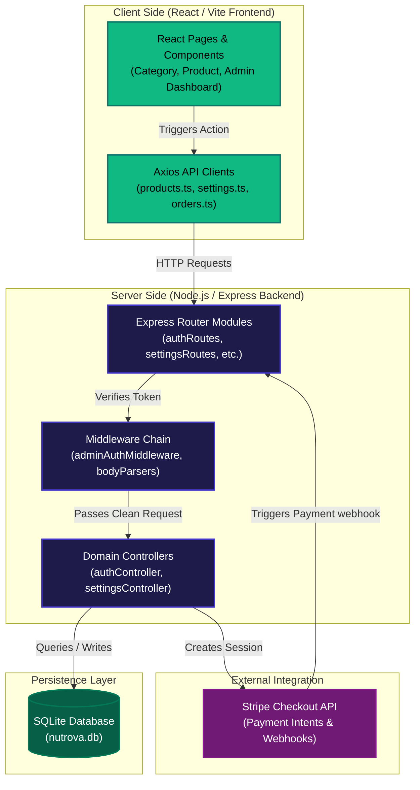
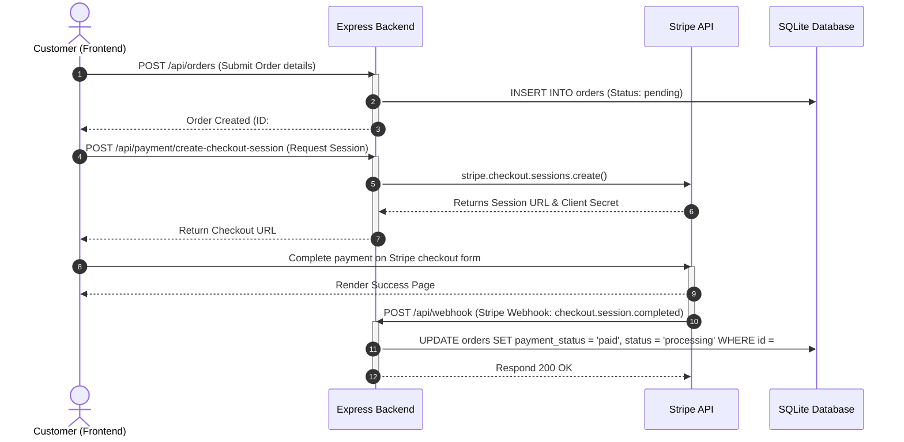
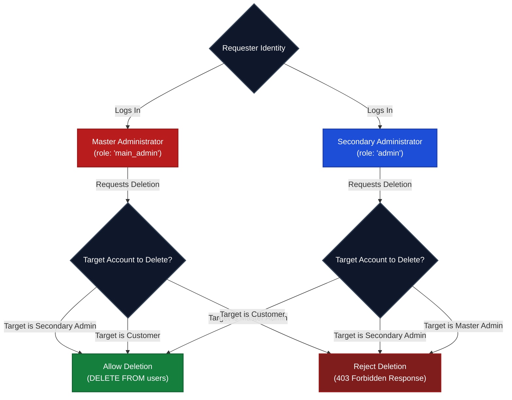

# CeltiCore Architecture & Interaction Flowcharts

This document describes the high-level system architecture and interaction flowcharts for the CeltiCore E-Commerce platform.

---

## 1. High-Level System Architecture

The diagram below details the client-to-server data flows across pages, API client modules, Express middleware layers, controllers, and SQLite database storage.

---

## 2. Customer Purchase & Stripe Webhook Flow

This flowchart illustrates the sequence of actions starting from user checkout, creating a session, redirected payment, and backend database updating via Stripe webhooks.

---

## 3. Administrative Privilege & Deletion Restrictions

This flowchart visualizes the strict permission logic applied to user accounts and secondary administrator profiles.

